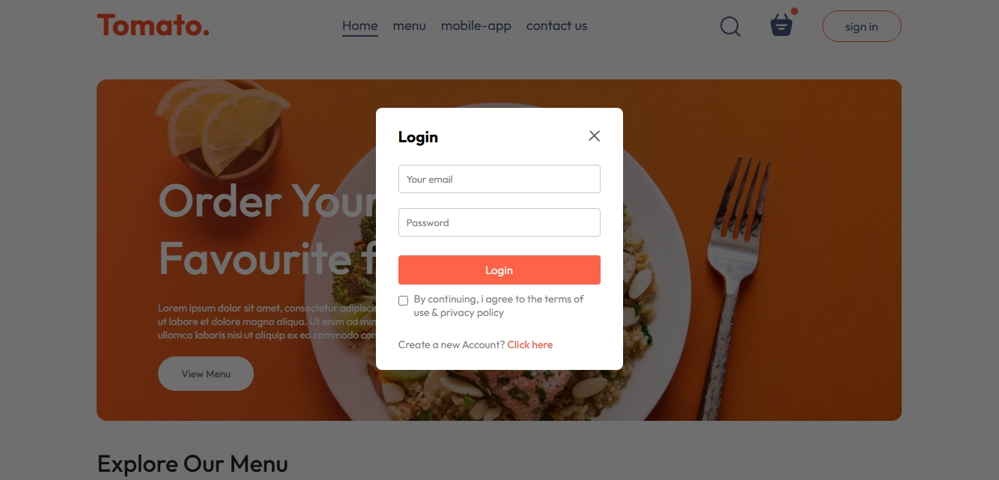
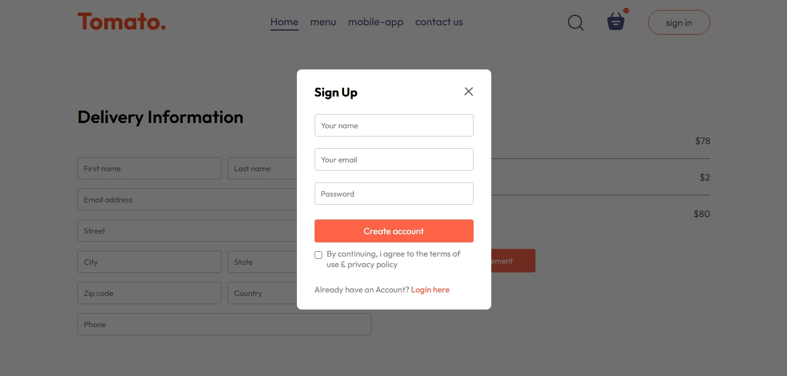
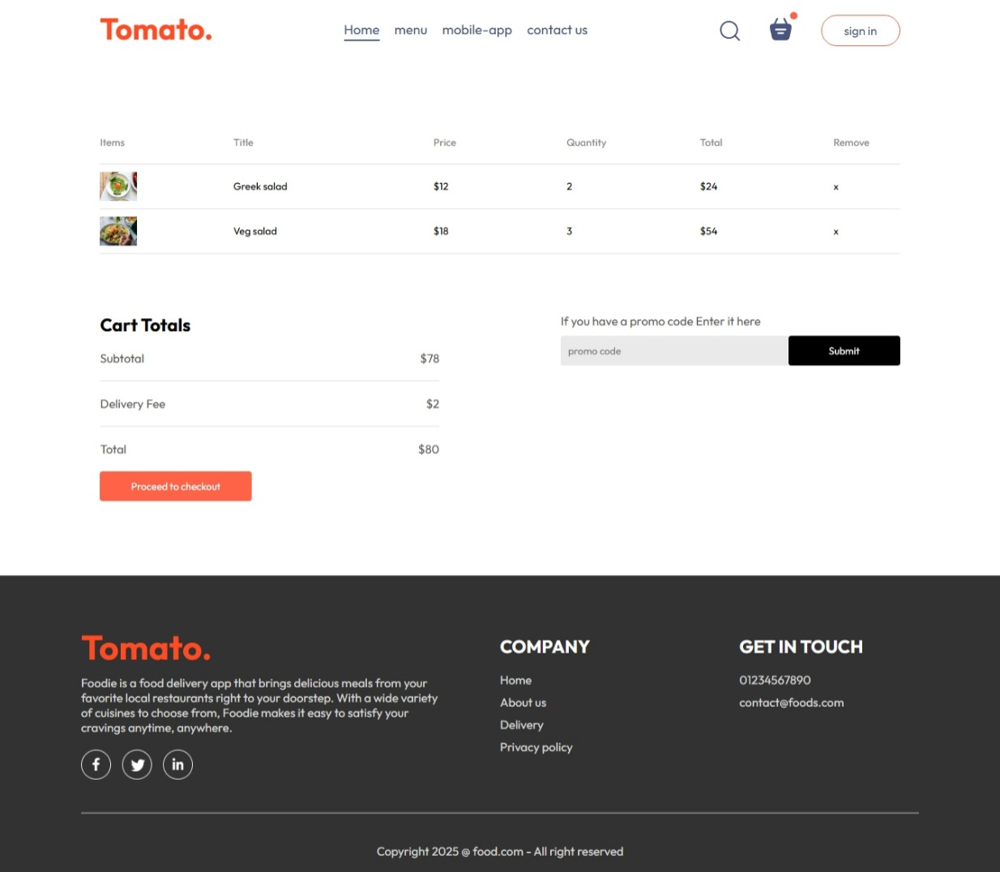
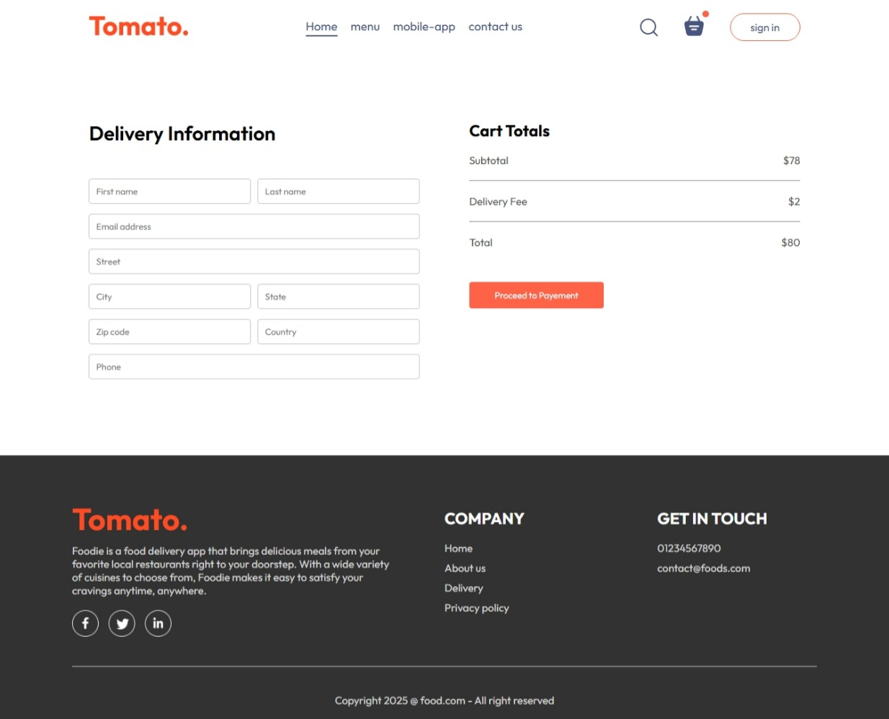
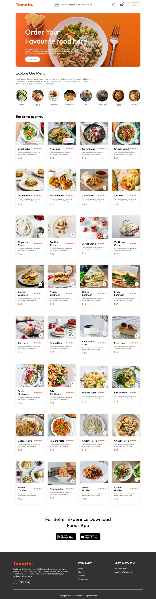

# Food Delivery App

A modern, single-page food delivery web application built with **ReactJS**, **HTML**, **CSS**, and **JavaScript**. The app allows users to browse food items, view item details, manage a shopping cart, and sign up or sign in to their accounts. The application consists of four main pages: Home, Cart Details, Cart (Checkout), and Signup/Signin.

## Table of Contents
- [Features](#features)
- [Technologies Used](#technologies-used)
- [Installation](#installation)
- [Usage](#usage)
- [Pages](#pages)
- [Pages Screenshots](#Pages-Screenshots)

## Features
- Browse a list of food items on the Home page.
- View detailed information about each food item on the Cart Details page.
- Manage items in the cart (add/remove) and review the order before payment on the Cart page.
- User authentication with Signup and Signin functionality.
- Responsive design for seamless use on desktop and mobile devices.
- Context API for state management (e.g., cart items).
- Navigation using React Router for a smooth single-page application experience.

## Technologies Used
- **ReactJS**: Front-end library for building user interfaces.
- **HTML5**: Markup for structuring the application.
- **CSS3**: Styling for responsive and visually appealing design.
- **JavaScript (ES6+)**: Logic for interactivity and state management.
- **React Router**: Client-side routing for navigation between pages.
- **Vite**: Build tool for fast development and production builds.
- **Context API**: For managing global state, such as cart items.

## Installation
1. **Clone the repository**:
   ```bash
   git clone https://github.com/your-username/food-delivery-app.git
   cd food-delivery-app
   ```

2. **Install dependencies**:
   ```bash
   npm install
   ```

3. **Start the development server**:
   ```bash
   npm run dev
   ```
   The app will be available at `http://localhost:5173` (or another port if configured differently).

4. **Build for production** (optional):
   ```bash
   npm run build
   ```
   The production-ready files will be generated in the `dist/` folder.

## Usage
- Navigate to the Home page to browse available food items.
- Click on a food item to view its details on the Cart Details page.
- Add items to the cart and review them on the Cart page before proceeding to payment.
- Use the Signup/Signin pages to create an account or log in.
- The navigation bar provides links to all pages and includes a cart icon with a visual indicator for items in the cart.

## Pages
1. **Home**: Displays a list of food items with images, names, prices, and descriptions. Users can add items to the cart from here.
2. **Cart Details**: Shows detailed information about a selected food item (e.g., description, price, and add-to-cart option).
3. **Cart (Checkout)**: Displays the cart contents, allowing users to add or remove items and review the order before payment.
4. **Signup/Signin**: Provides forms for users to create an account or log in, with a toggle to show the sign-in form.

## Pages-Screenshots
<p align="center"></p>
<p align="center"></p>
<p align="center"></p>
<p align="center"></p>
<p align="center"></p>